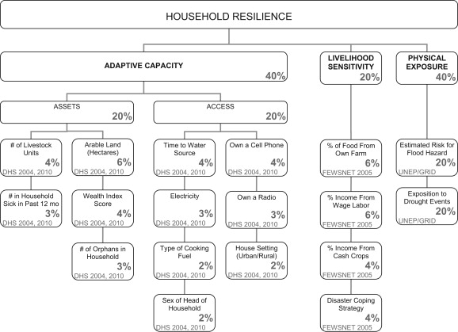
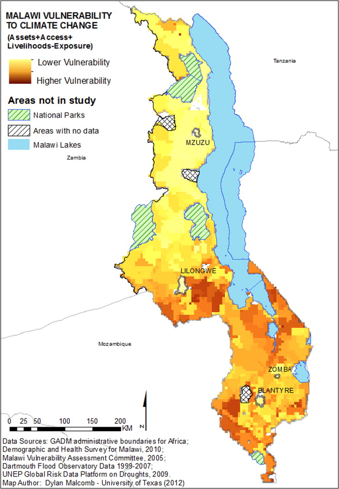

## Multi-criteria analysis of Vulnerability in Malawi

The goal of this lab was to try to reproduce the results found in [Vulnerability modeling for sub-saharan Africa: an oerational approach in Malawi](https://www.sciencedirect.com/science/article/pii/S0143622814000058).
To do this, data was collected from GDAM, DHS survey data, and UNEP Global Risk data. The data files and results from this lab are compiled in this [zip file](L78_data.zip). The article measured socioeconomic household resilience by traditional authorities in Malawi and a rasterized grid of vulnerability to climate change. The factors Malcomb et al. took into account can be seen in the cart below:



In order to convert the Global flood risk (fl_risk.tif) and Malawi drought exposure (dr_physexp.tif) rasters from UNEP Global Risk data into SQL code, we used the raster2pgsql command-line program. Global food risk data must be used because the Malawi floodr risk dta was clipped incorrectly and the Africa and malawi extract are the population exposure to risk not the 0 to 5 scale. This commandline was adapted to have flags where users can input the coordinate reference system ID of their girds (-s) (we used 4326) and the ability to overwrite an existing table (-d).
```
:: [command line program] -s [coordinate reference system] -d [will overwrite existing tables] [raster] [name_of_postgres_schema.new_table_name] > [sql file name to store the raster data]
K:\gg323\raster2pgsql\raster2pgsql -s 4326 -d fl_risk.tif public.fl_risk > fl_risk.sql
K:\gg323\raster2pgsql\raster2pgsql -s 4326 -d dr_physexp.tif public.dr_physexp > dr_physexp.sql
```
The resulting SQL files were loaded into PostGIS.

SQL code for raster stuff??

To prepare the dhshh data, each person in our class wrote an SQL querry to classify the DHS survey data categories into quantiles. A lower quantile score (1 being the lowest) corresponds to a lower resilience and a higher quantile score (5 being the highest) corresponds to a higher resilience. For example, having a larger number of orphans at a DHS point is an indicator of the area's high vulnerability (less resillient), while a small number of orphans in an area is an indicator of the area's lower vulnerability (more resillient). Professor Holler compiled our SQL querries and created this [SQL script](vulnerabilitySQL.sql) that assings each dhs cluster (an id with location information) to the traditional authority that it falls within, assigns that traditional authority id to each dhs household data point, adds a column for each DHS survey category included, assings a quantile value (1-5) for each category for each household, and sums the categories (with a weighted sum based off of the chart at teh top of the page) for each household. The final step of household capacity anlysis calculates the socioeconomic resilience of each traditional authority by averaging the scores of the households that fall in each cluster in each traditional authority. The DHS survey data categories included in measuring vulnerability were those corresponding to (stated explicitly with dhs metadata id code in the SQL script). 


The[Model](malawi_lab.model3) used is
Results:
The results were similar in that the southern end of Malawi tended to score higher on the resilience measurements; however, our reproduction was not complete. Principally, we we were not able to include all of the data the author used (missing the Livelihood Sensitivity from FEWSnet), and there was uncertainty in how the quantile values were assigned to the boolean DHS survey responses. This analysis was prefomed with SQL and PostGIS and with the above model in QGIS.


Malcomb et al. results:



Sources:
Malcomb, D. W., E. A. Weaver, and A. R. Krakowka. 2014. Vulnerability modeling for sub-Saharan Africa: An
operationalized approach in Malawi. Applied Geography 48:17–30.

Open Source GIScience course Middlebury College

PostGIS, QGIS

Find the data sets, models, qgis project and layers [here](L78_data.zip).
