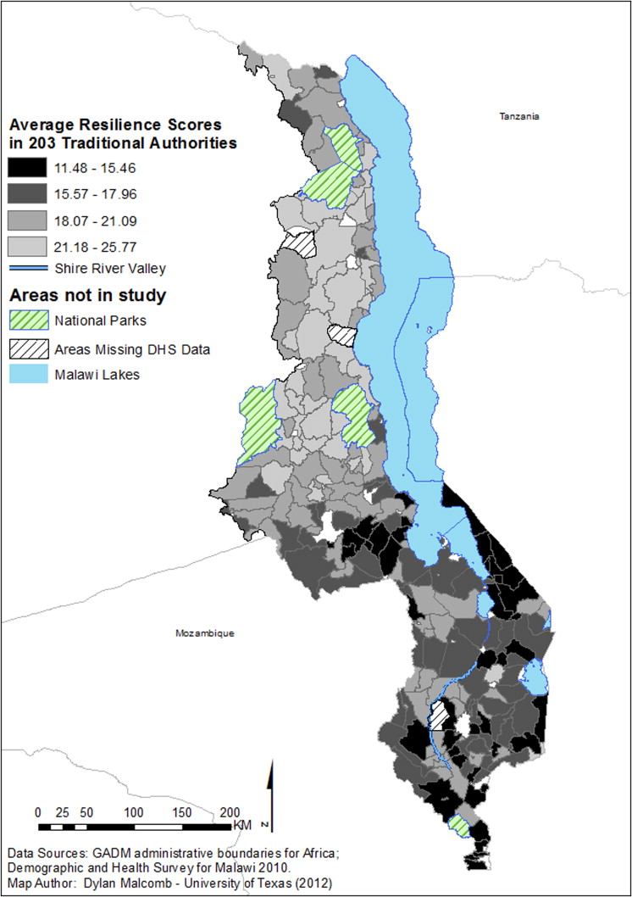

## Multi-criteria analysis of Vulnerability in Malawi

The goal of this lab was to try to reproduce the results found in [Vulnerability modeling for sub-Saharan Africa: an operational approach in Malawi](https://www.sciencedirect.com/science/article/pii/S0143622814000058).
To do this, data was collected from GDAM, DHS survey data, and UNEP Global Risk data. The data files and results from this lab are compiled in this [zip file](L78_data.zip). The article measured socioeconomic household resilience by traditional authorities in Malawi and a rasterized grid of vulnerability to climate change. The factors Malcomb et al. took into account can be seen in the chart on page 23 of his article.

In order to convert the Global flood risk (fl_risk.tif) and Malawi drought exposure (dr_physexp.tif) rasters from UNEP Global Risk data into SQL code, we used the raster2pgsql command-line program. Global food risk data must be used because the Malawi flood risk data was clipped incorrectly and the Africa and Malawi extract are the population exposure to risk not the 0 to 5 scale. This command line was adapted to have flags where users can input the coordinate reference system ID of their girds (-s) (we used 4326) and the ability to overwrite an existing table (-d).
```
:: [command line program] -s [coordinate reference system] -d [will overwrite existing tables] [raster] [name_of_postgres_schema.new_table_name] > [sql file name to store the raster data]
K:\gg323\raster2pgsql\raster2pgsql -s 4326 -d fl_risk.tif public.fl_risk > fl_risk.sql
K:\gg323\raster2pgsql\raster2pgsql -s 4326 -d dr_physexp.tif public.dr_physexp > dr_physexp.sql
```
The resulting SQL files were loaded into PostGIS.

To prepare the dhshh data, each person in our class wrote an SQL query to classify the DHS survey data categories into quantiles. A lower quantile score (1 being the lowest) corresponds to a lower resilience and a higher quantile score (5 being the highest) corresponds to a higher resilience. For example, having a larger number of orphans at a DHS point is an indicator of the area's high vulnerability (less resilient), while a small number of orphans in an area is an indicator of the area's lower vulnerability (more resilient). There was a lot of uncertainty in this replication process because no information was provided for how the Boolean categories (eg. yes or no responses) were divided into quantiles. Professor Holler compiled our SQL queries and created this [SQL script](vulnerabilitySQL.sql) that assigns each dhs cluster (an id with location information) to the traditional authority that it falls within, assigns that traditional authority id to each dhs household data point, adds a column for each DHS survey category included, assigns a quantile value (1-5) for each category for each household, and sums the categories (with a weighted sum based off of the chart at the top of the page) for each household. The final step of household capacity analysis calculates the socioeconomic resilience of each traditional authority by averaging the scores of the households that fall in each cluster in each traditional authority. The DHS survey data categories included in measuring vulnerability were those corresponding to (stated explicitly with dhs metadata id code in the SQL script). 

Malcomb et al. results:

My results:


To create a vulnerability map by traditional authority (which includes the household resilience, drought exposure, and flood risk) Professor Holler created a model that we subsequently modified. Here's the [model](malawi_lab.model3). The model takes the inputs livelihood zones, the socioeconomic resiliency scores of the traditional authorities, and the flood risk and drought exposure rasters. The model outputs a raster of socioeconomic resiliency, drought exposure, and flood risk all with the same extents and cell sizes. The model I made has a larger cell size resolution than that used by Malcomb et al. Grass tools r.quantile and r.recode were used to classify the drought raster into quantiles. Finally, raster calculator was used to make our 'reproduction' of Malcomb et al.'s vulnerability map.

Malcomb et al. results can be visualized on page 24 of his article.
My results:


The results were similar in that the southern end of Malawi tended to score higher on the resilience measurements and lower on vulnerability measurements; however, our reproduction was not complete. Principally, we were not able to include all of the data the author used (missing the Livelihood Sensitivity from FEWSnet), which was 20% of the of the vulnerability score the authors calculated. Many assumptions and guesses about the author's methods were also made along the way. These include:
- exactly which dhs layers were used in analysis
- how Boolean dhs categories were calculated into quantiles (some we chose to assign 2 or 3 for yes/no and some we assigned 1 or 5 - see sql scrip for which was used for each dhs category)
- what method was used to convert the drought exposure raster to a 1 to 5 scale (we used a quantile equal count method)
Due to the factors listed above, this paper is not reproducible. A more detailed methods section with step by step processes or a model in addition to the data sets used would make this achievable. 

As we were trying to reproduce this study, was due to the assignment of data clusters to traditional authorities and the resolution to which the final raster was converted. When re-reading the paper, Malcomb et al. referenced a method using STATA software to disaggregate the cluster data to the village level and then assign it to a traditional authority. We did not use this method, so our assignment of dhs clusters to traditional authorities could be extremely inaccurate as dhs cluster locations are displaced from 2 to 5 km to preserve anonymity. Therefore, the way we assigned dhs clusters to traditional authorities introduced a lot of error into the study, but maybe the STATA method is more accurate to the traditional authority level. And in terms of the resolution of the flood risk data, the flood risk data cell size was twice the size of the drought exposure cell size, but Malcomb et al. chose to use the smaller cell resolution. This decision also introduces greater error into the final raster product.

This reproducibility exercise in addition to the article we've read on reproducibility (Tate, 2013) has made me realize the importance of documenting and making available every step and decision made when doing GIS research. The methods aspect is necessary for truly reproducible work, but the decision making process and explanation of troubleshooting that occurred during the research process makes the replicability and development of research/research methods possible. However, taking these extra steps to make work replicable and reproducible take much more time and energy. Replicability of this type of study is also complicated by the fact that the factors making a population vulnerable in Malawi might be very different from the factors that make another population vulnerable (eg. the number of livestock a person has does not have a strong correlation to the vulnerability of someone living in Houston Texas). Similarly, the interview data they collected would not be possible for someone to replicate from their computer, so anyone trying to replicate this study would need to carry out the same interview process (which also might not be exactly applicable in other social/cultural structures) in another area.

Sources:
Malcomb, D. W., E. A. Weaver, and A. R. Krakowka. 2014. Vulnerability modeling for sub-Saharan Africa: An
operationalized approach in Malawi. Applied Geography 48:17–30.

Eric Tate (2013) Uncertainty Analysis for a Social Vulnerability Index, Annals of
the Association of American Geographers, 103:3, 526-543, DOI: 10.1080/00045608.2012.700616

Open Source GIScience course Middlebury College

PostGIS, QGIS
