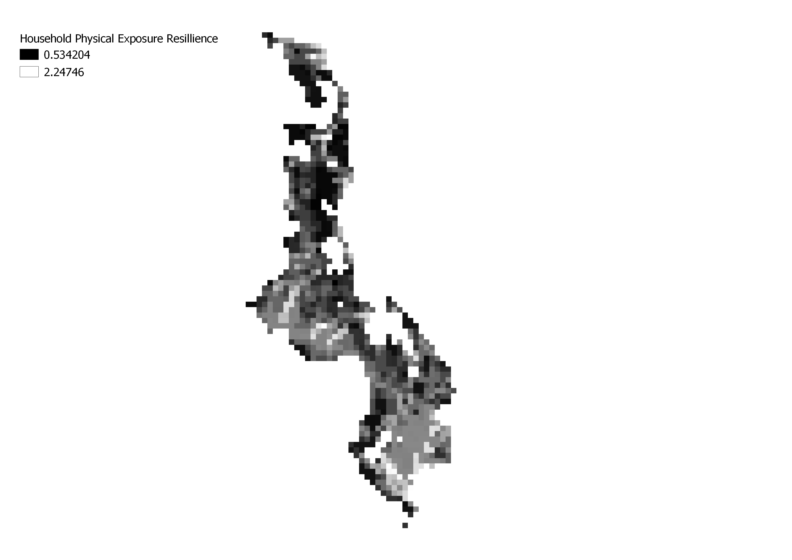
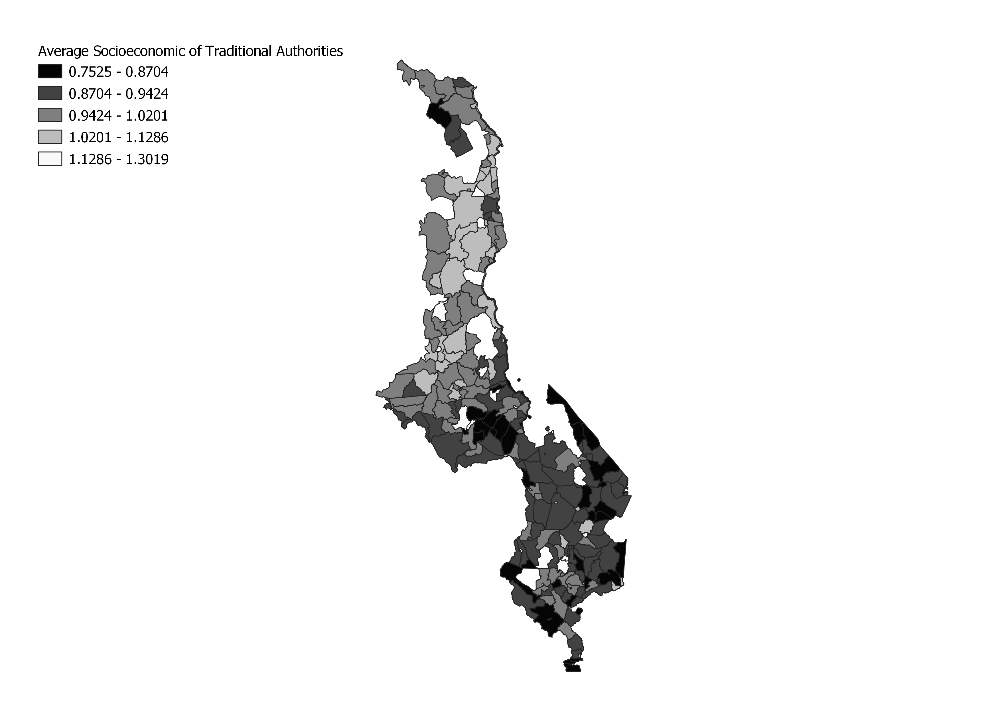

## Multi-criteria analysis of Vulnerability in Malawi

The goal of this lab was to try to reproduce the results found in [Vulnerability modeling for sub-saharan Africa: an oerational approach in Malawi](https://www.sciencedirect.com/science/article/pii/S0143622814000058).
To do this, data was collected from GDAM, DHS survey data, and UNEP Global Risk data.

[My Model](malawi_lab.model3)

Results:
The results were similar in that the southern end of Malawi tended to score higher on the resilience measurements; however, wour reproduction was not complete. Principally, we we were not able to include all of the data the author used (missing the Livelihood Sensitivity from FEWSnet), and there was uncertainty in how the quantile values were assigned to the boolean DHS survey responses.

Sources:
Malcomb, D. W., E. A. Weaver, and A. R. Krakowka. 2014. Vulnerability modeling for sub-Saharan Africa: An
operationalized approach in Malawi. Applied Geography 48:17–30.
Open Source GIScience course Middlebury College
