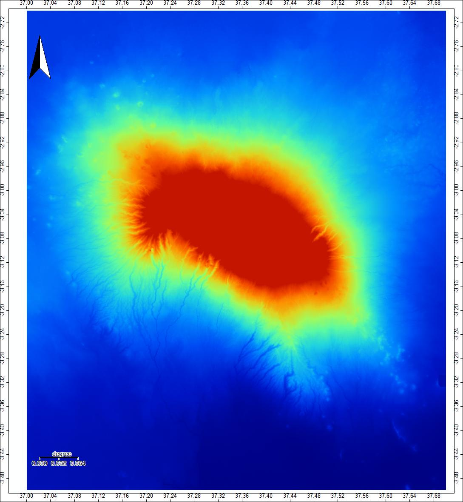
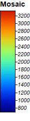
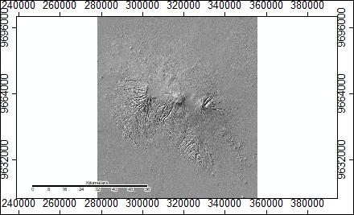
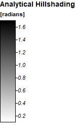

###Lab Three: Digital Elevation Models
9/26/2019

Today we worked with SAGA to create a model of streams and rivers based off of an Aster DEM. We chose to work with Mount Kilimanjaro,
so I downloaded the two tiles that cover Kilimanjaro. These two tiles are identified by their lower left coordinates: S04E037 and S03EO37.

After downloading the Aster data and opening it in SAGA, the first step we took to create the stream and river model was to mosaic the 
two tiles into one grid: Open Tools -> Grid -> Gridding -> Mosaicking. I adjusted the extend of the grids to only include Kilimanjaro.

 

You will notice that the scale is in degrees! So I changed the projection: Open Tools -> Projection -> Proj.4 -> UTM Projection (Grid).
The source was the mosaic created in the first step, and the cell size was changed to 30.

The third step was to create a hillshade visualization: Open Tools -> Terrain Analysis -> Lighting, Visibility -> Analytical Hillshading.
This shows the relatively higher elevations as lighter greys, and the relatively lower elevations as darker greys.
This new layer, and all the subsequent layers, should be made with the Elevation Grid system you created by changing the projection.

 

To detect sinks (areas where flow will pool and not be able to continue to flow normally and thus conflict with later steps), we used 
the sink removal tool: Open Tools -> Terrain Anlysis -> Preprocessing ->Sink Drainage Route Detection.

![mosaic_UTM]

Sources:
NASA/METI/AIST/Japan Spacesystems, and U.S./Japan ASTER Science Team. ASTER Global Digital Elevation
Model V003. 2019, distributed by NASA EOSDIS Land Processes DAAC,
https://doi.org/10.5067/ASTER/ASTGTM.003.

Opensource GISience course at Middlebury College
