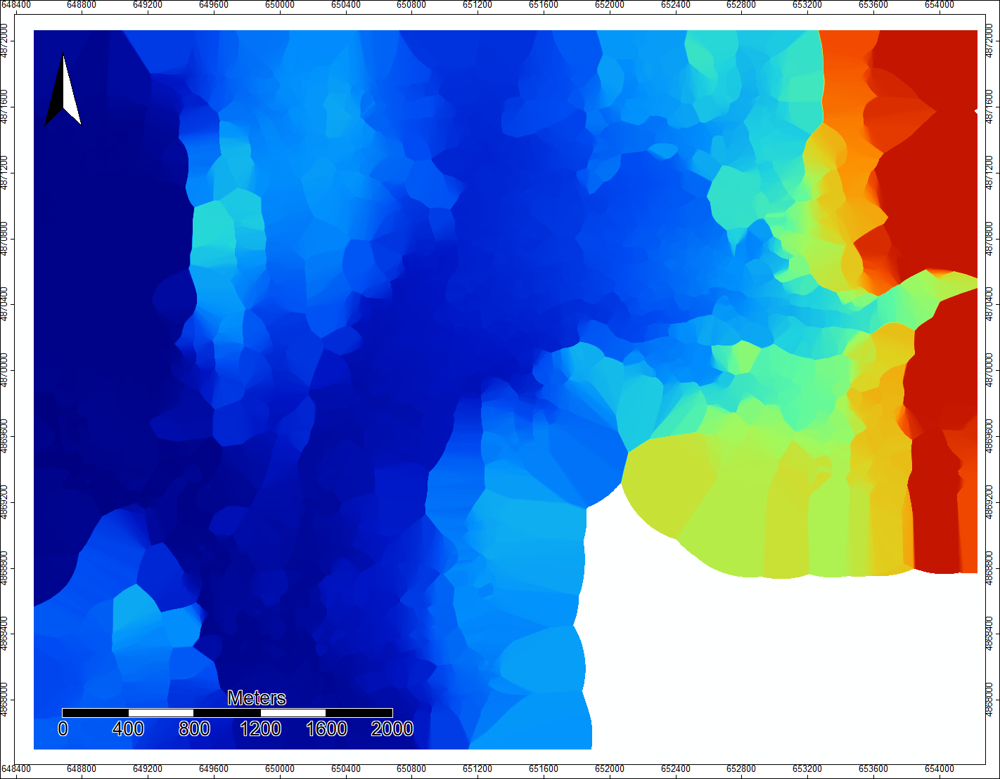
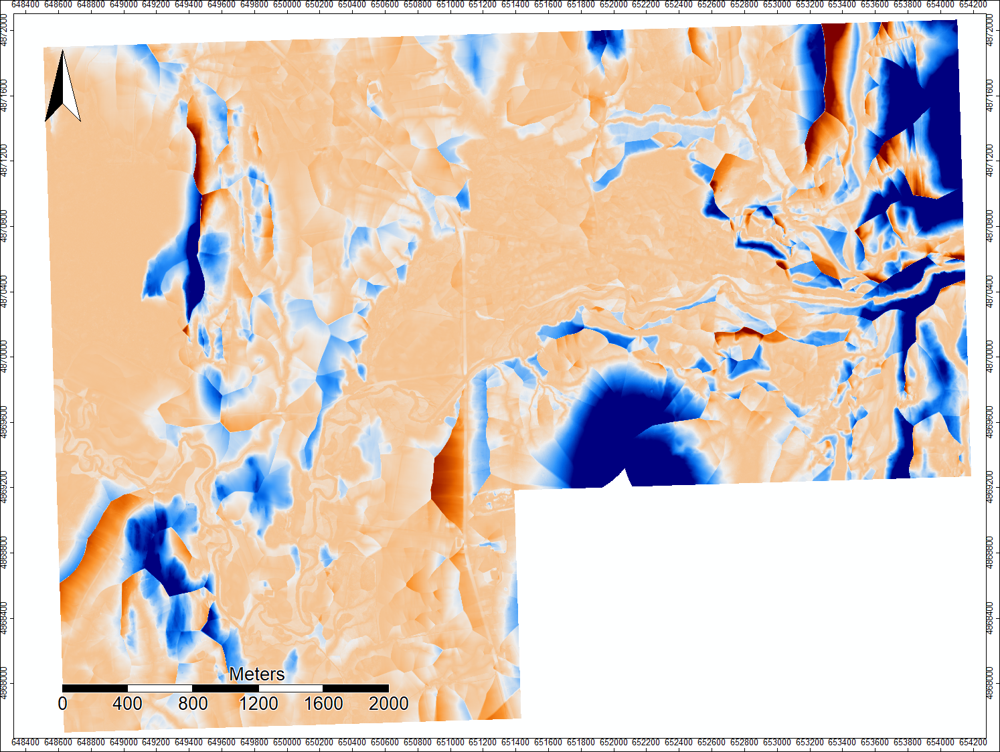
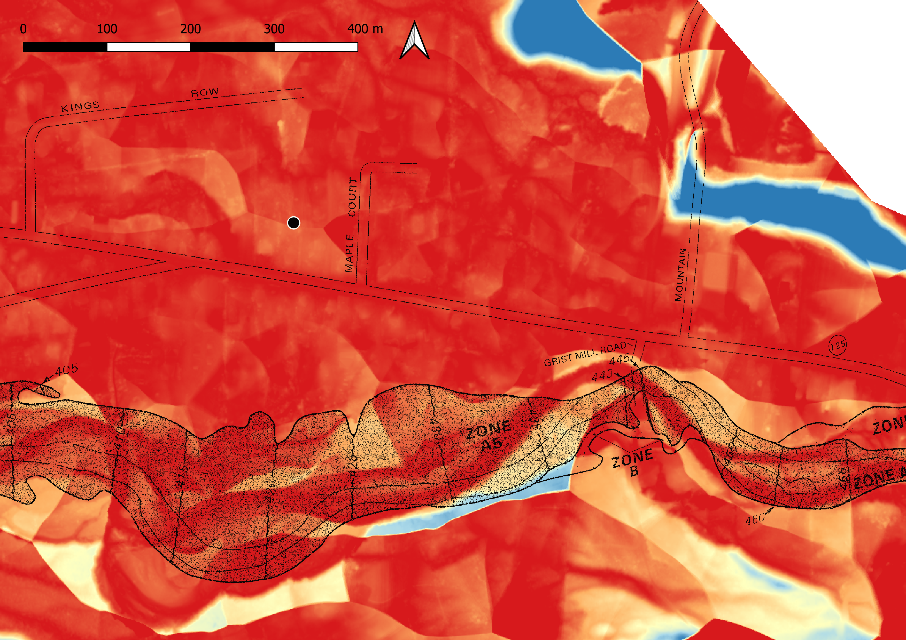

## Flood Plain Analysis on the Middlebury River
In this final project, I chose to build upon the SAGA stream analysis performed in lab 4. The goal for this project was to determine the elevation of flood plains relative to the surface of the river and compare those elevation-based flood plains to FEMA’s flood plain maps. This analysis was implemented on the Middlebury River from where the river exits the Green mountains at East Middlebury and where it joins Otter Creek. This analysis uses open source programs SAGA and QGIS and Vermont Lidar elevation data.

### FEMA Flood Mapping
FEMA identifies Special Flood Hazard Areas (SFHA) as the areas that fall in the 100- and 500-year flood plains. These areas are identified as Zone A[…] or V[…] and B or X respectively. However, the FEMA flood hazard boundary maps (eg. flood plain maps) for the Middlebury River were last updated in 1985. The Middlebury River has shifted significantly since the creation of these maps, the river even extending outside of the flood plain in some areas of the map. This fast river migration is due, in part, to the frequent flooding events occurring along this corridor. The ‘100 year flood plain’, as marked by the FEMA maps, has flooded five different times in the past 11 years (Flowers 2019; Landslide Natural Resource Planning 2008). FEMA is currently remapping many of the flood hazard boundaries in Vermont, and as of 2019 has agreed to invest in an East Middlebury flood resiliency project (learn more about the project [here]( https://addisonindependent.com/news/one-more-test-middlebury-river-flood-project).

### Flood Plain Analysis with SAGA
The first step I took was to download Lidar elevation tiles for the area:
Lidar data downloaded from [here](http://maps.vcgi.vermont.gov/opendata/tileselect_opendata.html?IndexLayerName=Index_ElevationDEM_DEMHF0p7M2017&FolderURL=http://maps.vcgi.vermont.gov/gisdata/vcgi/lidar/0_7M/2017/DEMHF/&cdownload=-1&InputLayerName=Index_ElevationDEM_DEMHF0p7M2017&InputFtype=raster). I chose 9 tiles from the 0.7 meter Digital Elevation Model - hydro flattened derived from 2017 lidar data (QL2). These nine tiels start in East Middlebury and go to right before Middlebury River meets Otter Creek.

From here I used this [batch script](flowanalysis.bat) to run flow analysis of the mosaicked of Lidar tiles. I developed this batch script in [Lab 4](Lab4.md). The flow analysis produced several final products that are good for visualization, but only one that was used for the rest of the analysis: the channel network shapefile. The channel network shapefile is a line vector file of the stream routes that were determined based off of the stream flow analysis. After playing around with several different visualizations, I chose to create stream channels for areas where flow accumulation was greater than 100,000 cells. This eliminated very small tributaries. Later on in the flood plain analysis, this would also allow the Middlebury River stream channel elevation to weigh heavier in the elevation interpolation map.

After generating a flow analysis, the next step in creating a flood plain map was to create an elevation map based off of the elevation of the stream channels. The elevations of the stream channels needed to be expanded (interpolated) to the area around the stream in order to create a raster (the same size as the mosaic) with the elevations of the nearest stream channel elevations. The stream channel elevations were found by extracting the mosaic raster elevations at the stream channel points (from the created point vector shapefile) and adding those elevations to the point vector file. Then using Inverse Distance Weighted (IDW) interpolation, the elevations used at those stream points were used to create an elevation raster. IDW interpolation determined the elevation of spots on the raster based off of surrounding elevation data points but weighting the closest points most heavily in determining the interpolated elevations. The final step to determine flood plains, or the elevation difference between the surface of the stream channel and the surrounding land, was to subtract the actual elevation data from the interpolated elevation data.

......................

The steps taken in SAGA are documented with each tool and parameter used in the final elevation difference raster’s [tool chain history](difference_toolchain.xml). The steps are also outlined below:

I downloaded lidar data into SAGA GIS 2.3.2 and opened the 9 tiles on the same map. I am not sure exactly what the different parameters were, but something in the Mosaicking tool in SAGA 6 was giving me a mosaic that had slight gaps between the North/South borders of the Lidar tiles. These gaps did not allow for a continuous stream flow analysis, so I created a mosaic in Saga 2.3.2 first and then preformed the rest of the analysis in Saga 6.2.0

----Open Tools -> Grid -> Tools -> Mosaicking

I then transferred to Saga 6.2.0 to finish the rest of the flow analysis. I created a point file from the stream channel line vector file. This step was necessary because in order to perform an Inverse Distance Weighted (IDW) interpolation you must have data points not lines.

----Shapes -> points -> convert lines to points (lines: chanlshapes file.shp, Points: create, insert additional points (check), Insertion: per line segment, Insertion Distance: 1, Add point order: unchecked)

I added mosaic elevation data to the point values.

----Grid Tools -> Add Grid Values to Points (Points: chnl shapes file points.shp, Result: chnl shapes file points.shp, Grids: mosaicUTM, Resampling: Bilinear interpolation)

Then I ran the IDW interpolation on the point shapefile. 

----Grid -> Gridding -> Inverse Distance Weighted (IDW) (Points: chnl shape file points, Attribute: mosaic, cross validation: none, Target Grid System: the grid system of the mosaic you used, target grid: create, search range local, maximum search distance: large enough to fill in all the gaps - I used 500, number of points: maximum number of nearest points, Minimum: 1, Maximum: 20, Direction: all directions, Weighting function: inverse distance to a power, Inverse Distance Weighting Power: 2)

Finally I subtracted the original mosaic elevation data from the IDW elevation data. 
----Grid -> Calculus -> Grid Difference (Grid System: grid system of the mosaic and IDW, A: mosaic, B: IDW, Difference(A-B): create)

......................

In order to compare this flood plain map (height from the water’s surface) to the 1985 FEMA flood hazard maps, I transferred over to QGIS. I clipped the flood plain raster to visualize the flood plain area more clearly (the dark red area generally outlined by a band of areas with increasing elevation rise from the stream level (yellow to blue colors). The flood plain seems to actually extend quite far to the north, making a large arc before being narrowed back down on the western side of the image and then expanding again after the moment of constriction (this Western end is cut off just before Middlebury River joins in with Otter Creek). This final expansion that extends up northwards again is the start of the Otter Creek flood plain. 

When looking closely near the river channel, the braids and old oxbows can be seen. When the FEMA map is georeferenced and overlaid the extensive channel migration can be noted. The georeferencing on this map is not perfect (the FEMA map should be shifted slightly to the left in the zoomed in image), but the river channel near East Middlebury has clearly shifted on a scale of ~10 m. This section of the Middlebury River is very close to down town East Middlebury (indicated by the black dot). Based off of this elevation data, East Middlebury appears to be right in the middle of what looks like it should be considered a 100- or at maximum a 500- year flood plain seeing as the change in elevation is not significant until the two blue patches further north of the town. The FEMA map is still relatively accurate at the Southwestern corner of the middle-zoomed image where the river is more constrained by steep topography.

The results from this project are preliminary. More investigation should be done into what interpolation method would provide the most accurate/precise stream elevation raster. More investigation into the ideal flow accumulation cell number to create a channel network should be undertaken to see what channel network extent will yield the best flood plain maps to asses flood hazards (maybe only the Middlebury River stream channel?). It would also be interesting to find flood extents and Middlebury River flow rates from the storms in the past 20 years to re-assign the recurrence frequency of the flood plains.

References, Sources, and Software used:

Open Source GIS course at Middlebury College; Professor Holler

Conrad, O., Bechtel, B., Bock, M., Dietrich, H., Fischer, E., Gerlitz, L., Wehberg, J., Wichmann, V., and Böhner, J. (2015): System for Automated Geoscientific Analyses (SAGA) v. 2.3.2, Geosci. Model Dev., 8, 1991-2007, doi:10.5194/gmd-8-1991-2015.

Conrad, O., Bechtel, B., Bock, M., Dietrich, H., Fischer, E., Gerlitz, L., Wehberg, J., Wichmann, V., and Böhner, J. (2015): System for Automated Geoscientific Analyses (SAGA) v. 6.2, Geosci. Model Dev., 8, 1991-2007, doi:10.5194/gmd-8-1991-2015. [Download](http://www.geosci-model-dev.net/8/1991/2015/gmd-8-1991-2015.html).

“FEMA Flood Map Service Center: Search By Address.” FEMA, msc.fema.gov/portal/search?AddressQuery=ripton%2Bvermont#searchresultsanchor.

Flowers, John. “One More Test for Middlebury River Flood Project.” Addison County Independent, 2 Sept. 2019, addisonindependent.com/news/one-more-test-middlebury-river-flood-project.
matcham2.0. “Inverse Distance Weighting in SAGA.” Spatially Challenged, 6 May 2019, spatiallychallenged.com/2019/05/09/inverse-distance-weighting-in-saga/.

“QGIS Development Team (2019). QGIS Geographic Information System. Open Source Geospatial Foundation Project. http://qgis.osgeo.org”.

“SAGA-GIS Module Library Documentation (v2.2.5).” Full Module Index / SAGA-GIS Module Library Documentation (v2.2.5), www.saga-gis.org/saga_tool_doc/2.2.5/a2z.html.
