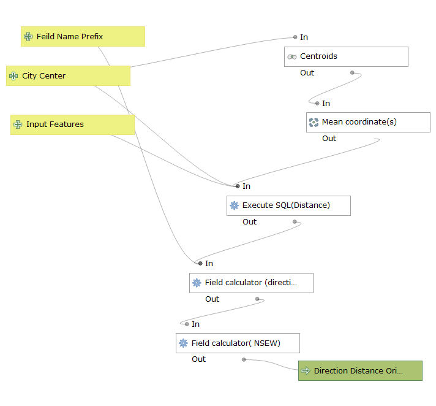
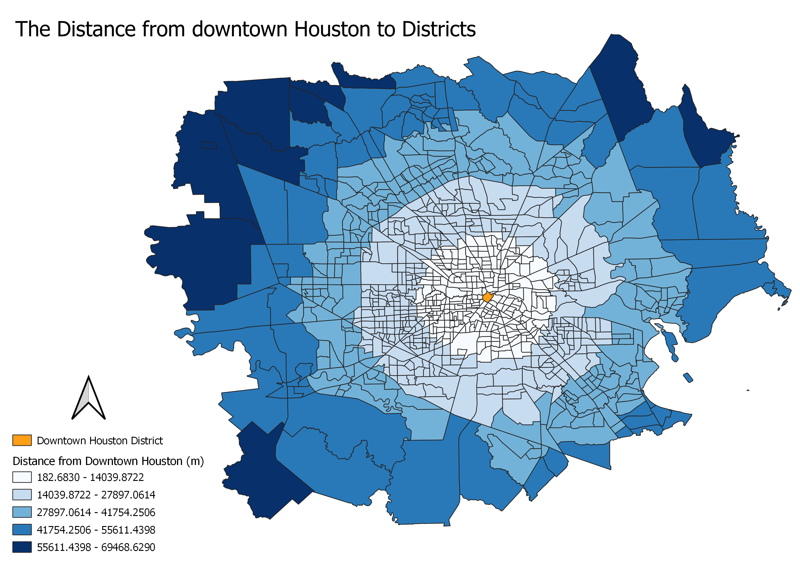
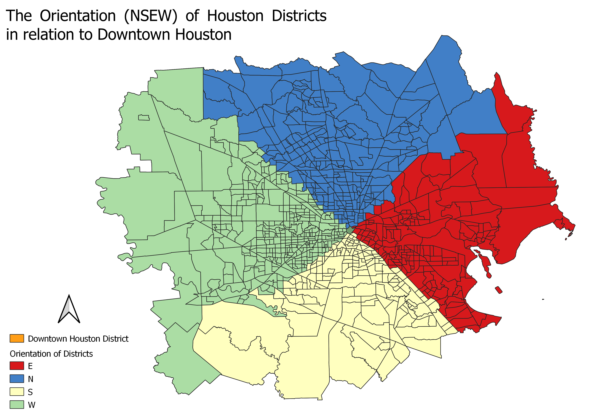

### Twitter Data 'use case'
[A review](blog2.md) of the reproducability and replicability of "Who Tweets with Their Location? Understanding the Relationship between Demographic Characteristics and the Use of Geoservices and Geotagging on Twitter" by Luke Sloan and Jeffery Morgan

### SQL Lab
In our recent [SQL Lab](sqllab.md) we used drain and wetland data from [Ramani Huria](http://ramanihuria.org/) to visualize drain density per subward and the intersection of subwards with wetlands. We used SQL queries to analyze and visualize the data. This lab is presented as a potential lesson plan/tutorial for other students.

### Lab 4 - Model Error Propagation and Uncertainty

10/9/2019

In [Lab 4](Lab4.md) I preformed a hydrological analysis of Mount Kilimanjaro with both Aster and SRTM data. The hydrological analysis was preformed with these two data types in order to compare the two results and find the preferable data source for this use.

### Lab 3 - Global Digital Elevation Models

9/26/2019

In [Lab 3](SAGA_Lab3.md) we worked with SAGA to create a model of streams and rivers based off of an Aster DEM.

### Lab 2 - First Model Revised!

9/24/2019

This model measures the distance, direction (degrees), and orientation (NSEW) of a polygon(s) from a central point or polygon.
Download the model: [Distance_Direction_Orientation_from_Center](DistanceSQL_direction_orientation_frompoint.model3)

I used this model to analyze data from the Houston 2017 census on Median gross rent.  This census data was collected from the 
Texas B25064 and B03002 tables in the 2017 ACS 5-year estimates topic on [American FactFinder](https://factfinder.census.gov/faces/nav/jsf/pages/index.xhtml).
The census tracts data for Texas was found [here](https://www.census.gov/geographies/mapping-files/time-series/geo/carto-boundary-file.html). The data I use is comprised of the Texas districts that I selected to make up the greater Houston area. After 
selecting the districts of interest, I joined the data columns I joined the census data to the census tract geographies. Find all
of the data I used in one concise place right [here!](Lab 1.zip).

In my model, I used the downtown Houston district as my 'City Center' from which the model would measure the distance, direction, 
and NSEW orientation of the districts. My 'Input features' were the greater Houston area districts. The results from the model 
can be seen in the maps below. The first map gives a visual representation of the distances to the districts measured from downtown
Houston, and the second map gives a visual representation of the NSEW orientation of the districts in relation to downtown Houston.

I used the direction data from my model to create a polar plot comparing the direction of a district relative to downtown Houston to
the median gross rent of that district. On this graph, 0 degrees = N, 90 degrees = E, 180 degrees = S, 270 degrees = W. The higher median gross rents tend to fall on the W/NW side of the city. 

Click on this [plot](Median_Gross_Rent_by_Direction_from_DTHOU.html) to see this information graphed with DataPlotly.

When applied to a metropolitan area, this model allows the user to analyze census data. After analyzing the data with this model, the user
can draw conclusions from this data and disseminate the new data and conclusions. The creation of this model, the analysis of data, and
the future drawing of conclusions illustrates the “Ambiguity of GIS as ‘Tool’ versus ‘Science’” Wright et al. delves into in their 2010
article. Wright et al. explains that the three primary ways in which GIS is perceived are GIS as a toolmaking platform, GIS as a tool, and
GIS as a science. In this instance, QGIS allowed for the creation of a tool (the model), the use of the model and GIS as a tool to analyze
the data and visually display the data, and then finally ‘doing science’ by making conclusions from this new data with QGIS functions used
to visually portray those conclusions. 

As the Wright et al. article concludes, and the use of GIS here can be framed to support, GIS can be seen as a ‘continua’ between the
classifications of tool, tool maker, and science. One of the cons to GIS is that anyone, especially with the development of opensource
GIS, can become a ‘scientist,’ easily processing, analyzing, and drawing conclusions from data. The fear is that without the baseline
geographic theories to contextualize the data analysis and conclusions, data can be easily misinterpreted or skewed. This may not be a
misguided fear. In “The Discourse and Discipline of GIS,” Martin and Wing see many of their students view GIS as “positivist, 
quantitative, and based on a Cartesian spatial logic” (236). A viewpoint that separates GIS practice from ‘human geography’ practice. The
theories and techniques learned from studying geography are no longer a necessary backbone ‘to do’ geography because of GIS. 

In fact, I am the perfect example of the human geographer’s nightmare! I have no background in geography, I have only ever used GIS as a
tool for geologic application, but I can take a course, learn about modeling, and apply that GIS knowledge to create a model that works
with social data instead of rock data. I will need to think critically about how I apply my GIS modeling to draw geographic conclusions in
the future!

### Lab 1 - First Model!

In our first lab we made a model that measures the distance and direction from a point to the centroid of a polygon.
Download [My First Model](Distance_and_direction_from_point.model3).

### Assignment 1

9/11/2019

A review of the article “[Open Network for Local Self Sustainability, Boosting 
Bioregional Development Through an Open Data Sharing System](https://www.int-arch-photogramm-remote-sens-spatial-inf-sci.net/XLII-4-W8/27/2018/isprs-archives-XLII-4-W8-27-2018.pdf)” taken from the FOSS4G 2019 conference.

This article explains a developing geodatabase called Open NETwork for Local Self Sustainability. 
The purpose of the database is to suggest a way to create the most self-sustainable 
communities, especially focusing on ways to make future community development take into account 
sustainability in their development planning. The database is modeled on Italian communities and 
focuses primarily on the scale of municipalities. The geodatabase aims to create self-sustainable 
communities by finding the most sustainable supply chain routes to a community for products that 
fall in the categories of housing, food, transport and waste. The indicators used to measure the 
self-sustainability of a supply chain for a product are the amounts of non-renewable primary energy, 
renewable primary energy, amount of productive land, and local manpower the chain uses. 
The database uses the opensource programs GRASS and QGIS to create the suggested sustainable supply
chains. In the future, the database hopes to expand the types of supply chains that are included by 
drawing in different fields of research.

To me, the open source nature of this project is extremely important to achieving this database’s 
goal. Being created on the open source programs QGIS and GRASS allow almost anyone to have access 
to the program, which is key in not only disseminating the program to city planners but also 
allowing people from different areas of research to contribute their supply chain data to the 
geodatabase. The Open NETwork for Local Self Sustainability necessitates different groups working 
together to achieve sustainability goals.

