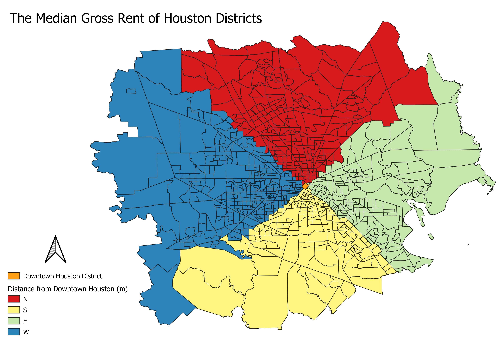

### Lab 2 - First Model Revised!

9/24/2019

This model measures the distance, direction (degrees), and orientation (NSEW) of a polygon(s) from a central point or polygon.
Download the model: [Distance_Direction_Orientation_from_Center](DistanceSQL_direction_orientation_frompoint.model3)

I used this model to analyze data from the Houston 2017 census on Median gross rent.  This census data was collected from the 
Texas B25064 and B03002 tables in the 2017 ACS 5-year estimates topic on [American FactFinder](https://factfinder.census.gov/faces/nav/jsf/pages/index.xhtml).
The census tracts data for Texas was found [here](https://www.census.gov/geographies/mapping-files/time-series/geo/carto-boundary-file.html). The data I use is comprised of the Texas districts that I selected to make up the greater Houston area. After 
selecting the districts of interest, I joined the data columns I joined the census data to the census tract geographies. Find all
of the data I used in one consise place right [here!](Lab 1.zip).

In my model, I used the downtown houston district as my 'City Center' from which the model would measure the distance, direction, 
and NSEW orientation of the districts. My 'Input features' were the greater Houston area districts. The results from the model 
can be seen in the maps below. The first map gives a visual representation of the distances to the districts measured from downtown
Houston, and the second map gives a visual representation of the NSEW orientation of the districts in relation to downtown Houston.

[Plot](Median_Gross_Rent_by_Direction_from_DTHOU.html)

### Lab 1 - First Model!

In our first lab we made a model that measures the distance and direction from a point to the centroid of a polygon.
Download [My First Model](Distance_and_direction_from_point.model3).

### Assignment 1

9/11/2019

A review of the article “[Open Network for Local Self Sustainability, Boosting 
Bioregional Development Through an Open Data Sharing System](https://www.int-arch-photogramm-remote-sens-spatial-inf-sci.net/XLII-4-W8/27/2018/isprs-archives-XLII-4-W8-27-2018.pdf)” taken from the FOSS4G 2019 conference.

This article explains a developing geodatabase called Open NETwork for Local Self Sustainability. 
The purpose of the database is to suggest a way to create the most self-sustainable 
communities, especially focusing on ways to make future community development take into account 
sustainability in their development planning. The database is modeled on Italian communities and 
focuses primarily on the scale of municipalities. The geodatabase aims to create self-sustainable 
communities by finding the most sustainable supply chain routes to a community for products that 
fall in the categories of housing, food, transport and waste. The indicators used to measure the 
self-sustainability of a supply chain for a product are the amounts of non-renewable primary energy, 
renewable primary energy, amount of productive land, and local manpower the chain uses. 
The database uses the opensource programs GRASS and QGIS to create the suggested sustainable supply
chains. In the future, the database hopes to expand the types of supply chains that are included by 
drawing in different fields of research.

To me, the open source nature of this project is extremely important to achieving this database’s 
goal. Being created on the open source programs QGIS and GRASS allow almost anyone to have access 
to the program, which is key in not only disseminating the program to city planners but also 
allowing people from different areas of research to contribute their supply chain data to the 
geodatabase. The Open NETwork for Local Self Sustainability necessitates different groups working 
together to achieve sustainability goals.

