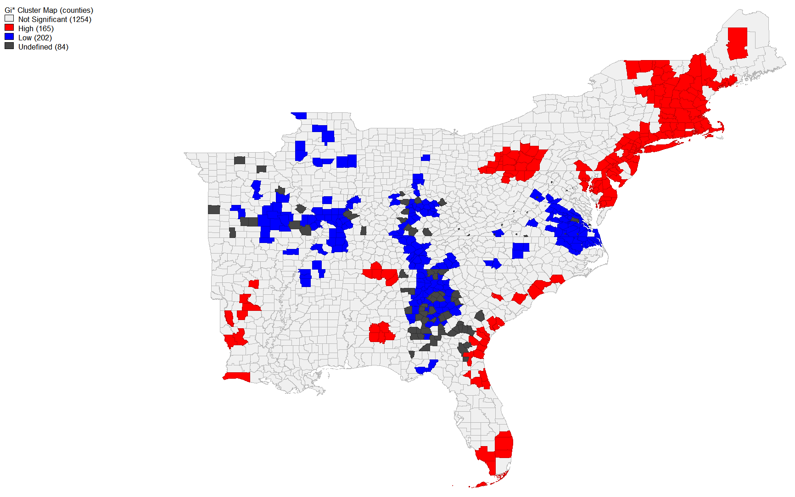

## Lab 10 - Twitter Analysis of Hurricane Dorian
In this lab we used the open source programs RStudio, PostGIS, QGIS, and GeoDa to analyze twitter usage during the week of hurricane Dorian.  The methods for this lab were developed by Professor Holler for the Opensource QGIScience course at Middlebury College.
### Downloading Data in R and Uploading to PostGIS
The datafiles used were created by Professor Holler, and his code used to create these files can be found [here](dorianTwitterScript.R). In order to upload the twitter data into my PostGIS database, I edited [this code](holler_twitter_program.r) provided by Professor Holler. Here’s the changes I made to Professor Holler’s code (from the ‘Upload Results to PostGIS Database’ section) in order to upload the tweets from a baseline week in November and ‘dorian’ related tweets from the week of the storm:
```
##### Edits from the Spatial Analysis Section – how to download census data #####
#get a Census API here: https://api.census.gov/data/key_signup.html
#replace the key text 'yourkey' with your own key!
usCounties <- get_estimates("county",product="population",output="wide",geometry=TRUE,keep_geo_vars=TRUE, key="#######")

##### Upload Data to PostGIS Database Section -- Edits #####
#Connecting to Postgres, Create a con database connection with the dbConnect function, Change the database name, user, and password to your own!
con <- dbConnect(RPostgres::Postgres(), dbname='cameron', host='artemis', user='cameron', password='...') 

#list the database tables in your database to check if the database is working
dbListTables(con) 

#create a simple table for uploading
dorianp <- select(dorian,c("user_id","status_id","text","lat","lng"),starts_with("place"))
novemberp <- select(november,c("user_id","status_id","text","lat","lng"),starts_with("place"))

#make all lower-case names for the tables if not already that way
counties <- lownames(usCounties)

#write data to the database, replace new_table_name with your new table name, replace dhshh with the data frame you want to upload to the database 
dbWriteTable(con,'dorian',dorian, overwrite=TRUE)
dbWriteTable(con,'november',november, overwrite=TRUE)
dbWriteTable(con,'counties',counties, overwrite=TRUE)
```
### PostGIS Analysis
After downloading twitter data and census data and uploading it to my PostGIS database, the USA Contiguous Lambert Conformal Conic projection (SRS code 102004) was used to transform the data into a projection that is suitable for the Eastern United States. I added this projection to my PostGIS from the PostGIS INSERT code found at https://www.spatialreference.org/ref/esri/102004/postgis/. The code is also pasted below – the pasted code removed an extraneous 9 at the start of SRS code in the insert statement.
```
/* Add projected coordinate system USA Contiguous Lambert Confromal Conic projection (102004) to PostGIS - code from 
www.spatialreference.org */
INSERT into spatial_ref_sys (srid, auth_name, auth_srid, proj4text, srtext) values 
( 102004, 'esri', 102004, '+proj=lcc +lat_1=33 +lat_2=45 +lat_0=39 +lon_0=-96 +x_0=0 +y_0=0 +ellps=GRS80 +datum=NAD83 +units=m +no_defs ', 
'PROJCS["USA_Contiguous_Lambert_Conformal_Conic",GEOGCS["GCS_North_American_1983",DATUM["North_American_Datum_1983",
SPHEROID["GRS_1980",6378137,298.257222101]],PRIMEM["Greenwich",0],UNIT["Degree",0.017453292519943295]],
PROJECTION["Lambert_Conformal_Conic_2SP"],PARAMETER["False_Easting",0],PARAMETER["False_Northing",0],
PARAMETER["Central_Meridian",-96],PARAMETER["Standard_Parallel_1",33],PARAMETER["Standard_Parallel_2",45],
PARAMETER["Latitude_Of_Origin",39],UNIT["Meter",1],AUTHORITY["EPSG","102004"]]');

#check to see if it imported
select * from spatial_ref_sys where srid = 102004
```
The analysis in the next section of the lab was performed with PostGIS in QGIS using SQL queries. Point geometries were created from the lat/long tweet coordinates and both the tweet and county data was converted to the new CRS. The states to be included in the analysis were filtered down to a smaller of those in the Eastern United States.
```
/*Add a geometry column to the tables*/
Select
addgeometrycolumn('public', 'november','geom',102004, 'POINT', 2)
Select
addgeometrycolumn('public', 'dorian','geom',102004, 'POINT', 2)

/*fill the column with point geometries from latitude and longitude coordinates and transforming the point to 
lambert Conformal Conic CRS*/
Select addgeometrycolumn('public', 'dorian','geom',102004, 'POINT', 2)
Select addgeometrycolumn('public', 'november','geom',102004, 'POINT', 2);
update dorian
set geom = st_transform(st_setsrid(st_makepoint(lng,lat),4326),102004);
update november
set geom = st_transform(st_setsrid(st_makepoint(lng,lat),4326),102004);

/*A geometry column already exists, but need to transform it to 102004 SRID*/
Select addgeometrycolumn('public','counties','geomtransf',102004,'MULTIPOLYGON',2);
update counties
set geomtransf = st_transform(st_setsrid(geometry,4326),102004);

/*choose the sates you want to include in analysis by eliminating the ones you don’t want */
DELETE FROM counties
WHERE statefp NOT IN ('54', '51', '50', '47', '45', '44', '42', '39', '37',
'36', '34', '33', '29', '28', '25', '24', '23', '22', '21', '18', '17',
'13', '12', '11', '10', '09', '05', '01');
```
The last step of the spatial analysis in PostGIS was to count the tweets per county for november and dorian. Using these counts, a normalized tweet difference index (ndti) was calculated: ndti = (tweets about storm – baseline twitter activity)/(tweets about storm/baseline twitter activity).
```
/* add a column in the twitter table and fill it with the county ID*/
alter table november add column geoid varchar(5);
update november
set geoid = countyfp
from counties
where st_intersects(november.geom, counties.geomtransf);
alter table dorian add column geoid varchar(5);
update dorian
set geoid = countyfp
from counties
where st_intersects(dorian.geom, counties.geomtransf)

/* create a temp table and count the tweets per county (geoid)*/
create view tweetcountnov as 
select count(geoid) as twtcount, geoid 
from november
group by geoid;
create view tweetcountdor as 
select count(geoid) as twtcount, geoid 
from dorian
group by geoid

/* add a tweetcount column and fill with the twtcount data (number of tweets per county) from the temp tables*/
alter table counties add column tweetcount integer;
update counties 
set tweetcount = twtcount 
from tweetcount1 
where tweetcount1.geoid = counties.countyfp;
alter table counties add column twtcountn integer;
update counties 
set twtcountn = twtcount 
from tweetcountnov
where tweetcountnov.geoid = counties.countyfp;

/* change twtcountd to float in a temporary table to calculate the tweet rate per
10000 people for dorian; add tweet density back to counties table*/
create view tweet1 as
select countyfp, cast(twtcountd as float)
from counties;
create view tweetrate as
select countyfp, twtcountd, (twtcountd / 10000) as tweetrate
from tweet1;
update counties
set twtrate = tweetrate
from tweetrate
where tweetrate.countyfp = counties.countyfp

/* Normalize the twitter data by making a new column for ndti (normalized tweet difference index) then filling that with ndti (tweets about storm - baseline twitter activity)/(tweets about storm + baseline twitter activity)*/
create view ndti_view3 as
select countyfp, cast(twtcountd as float), cast(tweetcount as float)
from counties;
create view ndti_view4 as
select countyfp, twtcountd, tweetcount, ((twtcountd - tweetcount)/(twtcountd + tweetcount)) as ndti1
from ndti_view3;
alter table counties add column ndtid real;
update counties
set ndtid = ndti1
from ndti_view4
where ndti_view4.countyfp = counties.countyfp;
```


### GeoDa analysis
GeoDa is an open-source GIS program that generates spatial statistics and can connect to PostGIS. From the counties table, we calculated the local G* statistic. The G* statistic measures the variation within a data set. We measured the variation of the tweet rate (twtrate). Twtrate is the number of tweets per 10000 people in each county. The G* statistic, measuring variation by county of tweet rate, created the following maps, visualized with a 0.05 significance:



Workflow to create these maps: 
Tools -> Weights Manager (weights file id variable: geoid; threshold distance default) -> Create
Space -> local G* cluster map (variable: twtrate) -> create (cluster map and row-standardized weights)

### QGIS Analysis
A heatmap (kernel density estimation) was weighted using the tweet rate of Dorian tweets. The pixel size was 500 meters, and the radius was 100,000 m.


### Analysis

My results showed high significant tweets in Florida, along the eastern US coastline, and then in the Northeast. There was some patches of dorian related tweets in Louisiana and Alabama that could have been the result of President Trump's 'Fake Shaprie Map,' but the majority of the signifiantly high tweet rates about Dorian came from the East Coast. The Northestern high significance of tweets is a surprising result from the G* signifiance maps. The significantly low tweets about dorian in the center of the East seems to fit with Hurricane Dorian's actual path. The tweet rate about Dorian per 10000 people (shown by the heat map and county map above).
